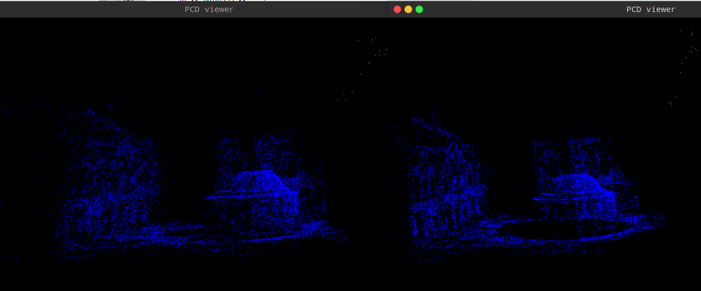

# ch10 后端优化1 位姿+路标点

## 输出为PCD文件

第十章开始代码就复杂和专业起来了，好像不是不是高博写的了，不过认真看还是容易看懂的，首先输出结果用ply文件，用meshlab看就比较不习惯了，这里加了一个函数输出为pcd文件。下面是优化前后对比。



蓝色的是点云，右上角黄色的16个点，为16个相机的位置。右边是优化后的点云和相机位姿，墙面明显更加平整。

下面是代码：

```cmake
find_package(PCL  REQUIRED) 
include_directories(${PCL_INCLUDE_DIRS}) 
link_directories(${PCL_LIBRARY_DIRS}) 
add_definitions(${PCL_DEFINITIONS})
target_link_libraries(${PROJECT_NAME} BALProblem ParseCmd ${CERES_LIBRARIES} ${PCL_LIBRARIES})
```

```c
#include <pcl/io/pcd_io.h> 
void BALProblem::WriteToPCDFile(const std::string& filename)const{
  
    typedef pcl::PointXYZRGB PointT; 
    typedef pcl::PointCloud<PointT> PointCloud;
    
    PointCloud::Ptr pointCloud( new PointCloud ); 
    
    double angle_axis[3];
    double center[3];
    for(int i = 0; i < num_cameras(); ++i){
      const double* camera = cameras() + camera_block_size() * i;
      CameraToAngelAxisAndCenter(camera, angle_axis, center);
      PointT p;
      p.x=center[0];
      p.y=center[1];
      p.z=center[2];
      p.b=150;
      p.g=170;
      p.r=255;
      pointCloud->points.push_back(p);
    }
    
    const double* points = parameters_ + camera_block_size() * num_cameras_;
    for(int i = 0; i < num_points(); ++i){
      const double* point = points + i * point_block_size();
      PointT p;
      p.x=point[0];
      p.y=point[1];
      p.z=point[2];
      p.b=255;
      p.g=100;
      p.r=90;
      pointCloud->points.push_back(p);
    }
    std::cout<<"点云共有"<<pointCloud->size()<<"个点."<<std::endl;
    pcl::io::savePCDFileBinary(filename, *pointCloud );
}
```

## 数据结构

g2o和ceres的操作，在前面章节代码熟悉的情况下，已经不难理解，==g2o设置借助ceres的自动求导需要mark下==，最需要理解的是数据结构对数据的保存和传递，都用的是原始的数组首地址指针传递进入优化，需要优化的两个顶点，一个是相机位姿和内参，一个9维数组，前三个是旋转，中间三个是平移，最后三个是内参(f,cx,cy)。

另一个顶点是路标点，三维数组。一共16个相机顶点，22106个路标点。