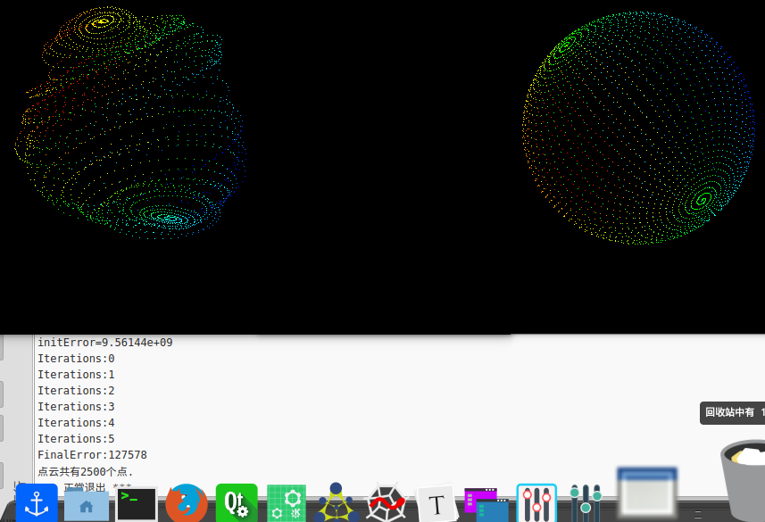

# ch11 用eigen和sophus手写后端位姿图优化

## pcd文件显示

由于g2o_viewer不太好用，全部写入pcd展示。



## 3d位姿图优化

[2d位姿图优化](https://github.com/Wleisure95/laser_slam/tree/master/ls_slam) 

在2d位姿图优化的基础上，用eigen和sophus手写实现。主要区别在于关于位姿的雅克比矩阵，增量更新变为李代数的左乘更新，在my_GN.cpp中实现。

```c
#include <iostream>
#include <fstream>
#include <string>
#include <vector>
#include <ctime>

#include <Eigen/Core>
#include <Eigen/Jacobi>
#include <Eigen/Dense>
#include <Eigen/Householder>
#include <Eigen/Cholesky>
#include <Eigen/LU>
#include <Eigen/QR>
#include <Eigen/SVD>
#include <Eigen/SparseCholesky>
#include <Eigen/Sparse>

#include <sophus/se3.h>
#include <sophus/so3.h>

#include <pcl/point_types.h> 
#include <pcl/io/pcd_io.h> 
#include <pcl/visualization/pcl_visualizer.h>

typedef pcl::PointXYZRGB PointT; 
typedef pcl::PointCloud<PointT> PointCloud;

using namespace std;
using Sophus::SE3;
using Sophus::SO3;

typedef Eigen::Matrix<double, 6, 1> Vector6d;
typedef Eigen::Matrix<double,6,6> Matrix6d;

Matrix6d JRInv( SE3 e )
{
    Matrix6d J;
    J.block(0,0,3,3) = SO3::hat(e.so3().log());
    J.block(0,3,3,3) = SO3::hat(e.translation());
    J.block(3,0,3,3) = Eigen::Matrix3d::Zero(3,3);
    J.block(3,3,3,3) = SO3::hat(e.so3().log());
    J = J*0.5 + Matrix6d::Identity();
    return J;
}

typedef struct edge
{
  int xi,xj;
  Sophus::SE3 measurement;
  Eigen::Matrix<double,6,6> infoMatrix;
}Edge;

double ComputeError(std::vector<Sophus::SE3> Vertexs,std::vector<Edge> Edges)
{
    double sumError = 0;
    for(int i = 0; i < Edges.size();i++)
    {
        Edge tmpEdge = Edges[i];
        Sophus::SE3 xi = Vertexs[tmpEdge.xi];
        Sophus::SE3 xj = Vertexs[tmpEdge.xj];
        Sophus::SE3 z  = tmpEdge.measurement;
        Eigen::Matrix<double,6,6> infoMatrix = tmpEdge.infoMatrix;

        Vector6d ei = (z.inverse() *  xi.inverse() * xj).log();

        sumError += ei.transpose() * infoMatrix * ei;
    }
    return sumError;
}

void CalcJacobianAndError(Sophus::SE3 xi,Sophus::SE3 xj,Sophus::SE3 z,
                          Vector6d& ei,Eigen::Matrix<double,6,6>& Ai,Eigen::Matrix<double,6,6>& Bi)
{
    //TODO--Start
    //误差 ei
    ei = (z.inverse() *  xi.inverse() * xj).log();

    //jacobian
    Matrix6d J = JRInv(SE3::exp(ei));
    Ai = - J* xj.inverse().Adj();
    Bi =   J* xj.inverse().Adj();

    //TODO--end
}

Eigen::VectorXd  LinearizeAndSolve(std::vector<Sophus::SE3>& Vertexs,std::vector<Edge>& Edges)
{
    //申请内存
    Eigen::MatrixXd H(Vertexs.size() * 6,Vertexs.size() * 6);
    Eigen::VectorXd b(Vertexs.size() * 6);

    H.setZero();
    b.setZero();

    //固定第一帧
    Eigen::Matrix<double,6,6> I;
    I.setIdentity();
    H.block(0,0,6,6) += I;

    //构造H矩阵　＆ b向量
    for(int i = 0; i < Edges.size();i++)
    {
        //提取信息
        Edge tmpEdge = Edges[i];
        Sophus::SE3 xi = Vertexs[tmpEdge.xi];
        Sophus::SE3 xj = Vertexs[tmpEdge.xj];
        Sophus::SE3 z  = tmpEdge.measurement;
        Eigen::Matrix<double,6,6> infoMatrix = tmpEdge.infoMatrix;

        //计算误差和对应的Jacobian
        Vector6d ei;
        Eigen::Matrix<double,6,6> Ai;
        Eigen::Matrix<double,6,6> Bi;
        CalcJacobianAndError(xi,xj,z,ei,Ai,Bi);

         //TODO--Start
        Eigen::Matrix<double,6,6> Hii,Hij,Hji,Hjj;
        Hii = Ai.transpose() * infoMatrix * Ai;
        Hij = Ai.transpose() * infoMatrix * Bi;
        Hji = Bi.transpose() * infoMatrix * Ai;
        Hjj = Bi.transpose() * infoMatrix * Bi;

        int idx = tmpEdge.xi;
        int jdx = tmpEdge.xj;

        H.block(6*idx,6*idx,6,6) += Hii;
        H.block(6*idx,6*jdx,6,6) += Hij;
        H.block(6*jdx,6*idx,6,6) += Hji;
        H.block(6*jdx,6*jdx,6,6) += Hjj;

        Vector6d bi,bj;
        bi = (ei.transpose() * infoMatrix * Ai).transpose();
        bj = (ei.transpose() * infoMatrix * Bi).transpose();

        b(6*idx+0) += bi(0);
        b(6*idx+1) += bi(1);
        b(6*idx+2) += bi(2);
	b(6*idx+3) += bi(3);
	b(6*idx+4) += bi(4);
	b(6*idx+5) += bi(5);

        b(6*jdx+0) += bj(0);
        b(6*jdx+1) += bj(1);
        b(6*jdx+2) += bj(2);
	b(6*jdx+3) += bj(3);
	b(6*jdx+4) += bj(4);
	b(6*jdx+5) += bj(5);
        //TODO--End
    }
    clock_t time_stt = clock();
//     Eigen::SimplicialCholeskyLLT solver;
//     solver.compute(H);
//     Eigen::VectorXd dx = -solver.solve(b);
    Eigen::VectorXd dx = -H.llt().solve(b);//98s迭代一次
  //Eigen::VectorXd dx = -H.lu().solve(b);//167s迭代一次
  //Eigen::VectorXd dx = -H.ldlt().solve(b);//250s迭代一次
  //Eigen::VectorXd dx = -H.colPivHouseholderQr().solve(b);//非常慢 20多分钟迭代一次
    cout<<"time_used = "<<1000*(clock()-time_stt)/(double)CLOCKS_PER_SEC<<"ms"<<std::endl;
    //TODO-End

    return dx;
}

int main ( int argc, char** argv )
{
    if ( argc != 2 )
    {
        cout<<"Usage: my_GN sphere.g2o"<<endl;
        return 1;
    }
    ifstream fin ( argv[1] );
    if ( !fin )
    {
        cout<<"file "<<argv[1]<<" does not exist."<<endl;
        return 1;
    }
 
    vector<Sophus::SE3> Vertexs;
    vector<Edge> Edges;
    while ( !fin.eof() )
    {
        string name;
        fin>>name;
        if ( name == "VERTEX_SE3:QUAT" )
        {
	  //顶点
            int index = 0;
            fin>>index;
            double data[7];
	    for(int i=0;i<7;i++)
	    {
	      fin>>data[i];
	    }
	    Eigen::Quaterniond q ( data[6], data[3], data[4], data[5] );
            q.normalize();
	    Sophus::SE3 Vertex(q, Eigen::Vector3d ( data[0], data[1], data[2] ));
            Vertexs.push_back(Vertex);
        }
        else if ( name=="EDGE_SE3:QUAT" )
        {
            // SE3-SE3 边
            int idx1, idx2;     // 关联的两个顶点
            fin>>idx1>>idx2;
	    Edge e;
	    e.xi = idx1;
	    e.xj = idx2;
	    double data[7];
	    for(int i=0;i<7;i++)
	    {
	      fin>>data[i];
	    }
	    Eigen::Quaterniond q ( data[6], data[3], data[4], data[5] );
            q.normalize();
	    e.measurement = Sophus::SE3(q, Eigen::Vector3d ( data[0], data[1], data[2] ));
	    Eigen::Matrix<double,6,6> info;
	    for ( int i=0; i<6 && fin.good(); i++ )
	      for ( int j=i; j<6 && fin.good(); j++ )
              {
                  fin >> info( i,j );
                  if ( i!=j )
                    info( j,i ) =info( i,j );
              }
            e.infoMatrix = info;
            Edges.push_back(e);
        }
        if ( !fin.good() ) break;
    }

    cout<<"read total "<<Vertexs.size()<<" vertices, "<<Edges.size()<<" edges."<<endl;
    
    double initError = ComputeError(Vertexs,Edges);
    cout<< "initError="<<initError<<endl;
    
    int maxIteration = 100;
    double epsilon = 1e-3;
    
    for(int i = 0; i < maxIteration;i++)
    {
        std::cout <<"Iterations:"<<i<<std::endl;
        Eigen::VectorXd dx = LinearizeAndSolve(Vertexs,Edges);

        //TODO--Start
        for(int k = 0; k < Vertexs.size();k++)
        {
	  //构造李代数增量。
	  Sophus::SE3 up(Sophus::SO3(dx(6*k+3), dx(6*k+4), dx(6*k+5)),Eigen::Vector3d(dx(6*k+0), dx(6*k+1), dx(6*k+2)));
	  //坐乘更新
          Vertexs[k] = up*Vertexs[k];
        }
        //TODO--End
        double maxError = -1;
        for(int k = 0; k < 6* Vertexs.size();k++)
        {
            if(maxError < std::fabs(dx(k)))
            {
                maxError = std::fabs(dx(k));
            }
        }
        cout<<"error_now="<<ComputeError(Vertexs,Edges)<<endl;
	cout<<"max epilon="<<maxError<<std::endl;
        if(maxError < epsilon)
            break;
    }

    double finalError  = ComputeError(Vertexs,Edges);
    std::cout <<"FinalError:"<<finalError<<std::endl;
    
    PointCloud::Ptr pointCloud( new PointCloud ); 
    for(int i=0;i<Vertexs.size();i++)
    {
      Sophus::SE3 v = Vertexs[i];
      Eigen::Vector3d pose=v.translation();

      PointT p ;
      p.x=pose(0);
      p.y=pose(1);
      p.z=pose(2);
      p.r=228;
      p.b=224;
      p.g=20;
      pointCloud->points.push_back(p);
    }
    std::cout<<"点云共有"<<pointCloud->size()<<"个点."<<std::endl;
    pcl::io::savePCDFileBinary("my_GN.pcd", *pointCloud );
    return 0;
}
```

关于增量方程求解，对比了eigen的几种所用的时间，llt最快。