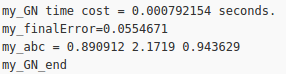
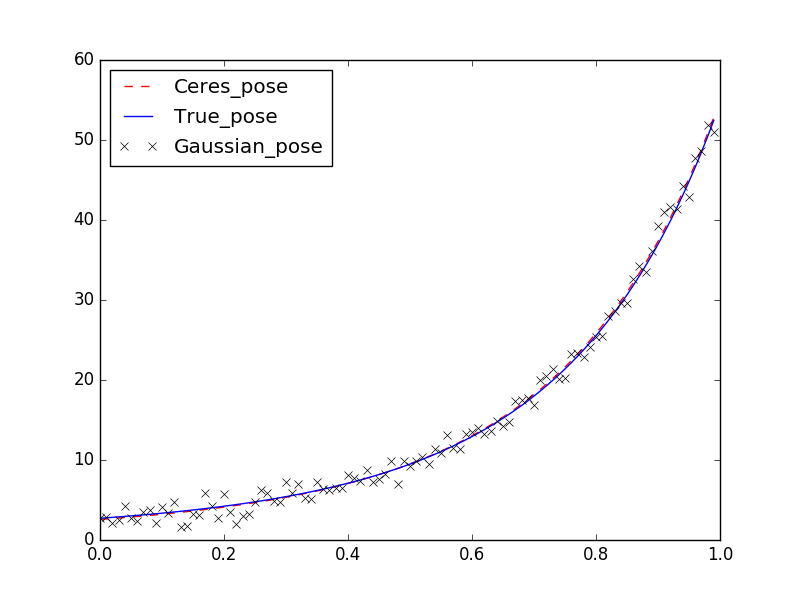

# ch6 优化

​        这一章两个工程，依赖的ceres库和g2o库我都用cmake -DCMAKE_INSTALL_PREFIX=/path/to/my_lib ..这种方式安装在自定义的位置，方便统一管理。

​        这一章两个工程，依赖的ceres库和g2o库我都用`cmake -DCMAKE_INSTALL_PREFIX=/path/to/my_lib ..`这种方式安装在自定义的位置，方便统一管理。

## Ceres

​        ceres提供了CeresConfig.cmake文件，在安装位置里面，只需要在Cmakelists提前设置`set( Ceres_DIR  "/home/leisure/all_ws/3rdparty/3rd_lib/Ceres-1.14.0/lib/cmake/Ceres")`就ok了。

​        高博提供的g2o安装下来没有这个文件，在高博提供的FindG2O.cmake中添加路径就好了。

​        在ceres_curve_fitting的main.cpp中，模仿[激光slam后端课程手写BA](https://github.com/Wleisure95/laser_slam/tree/master/ls_slam)，自己重新手写了一个优化，巩固一下。

```c
double computeError(double abc[3],vector<double> x_data,vector<double> y_data )
{
    double sumError = 0;
    for(int i = 0;i<x_data.size();i++)
    {
        double ei = y_data[i] - ceres::exp(abc[0]*x_data[i]*x_data[i]+abc[1]*x_data[i]+abc[2]);
	sumError += ei;
    }
    return sumError;
}

Eigen::Vector3d LinearizeAndSolve(double abc[3],vector<double> x_data,vector<double> y_data)
{
    Eigen::Matrix3d H;
    Eigen::Vector3d b;
    H.setZero();
    b.setZero();
    
    for(int i=0;i<x_data.size();i++)
    {
	double ei = y_data[i] - ceres::exp(abc[0]*x_data[i]*x_data[i]+abc[1]*x_data[i]+abc[2]);
	Eigen::Vector3d AiT;
	AiT(0,0) = -ceres::exp(abc[0]*x_data[i]*x_data[i]+abc[1]*x_data[i]+abc[2])*x_data[i]*x_data[i];
    AiT(1,0) = -ceres::exp(abc[0]*x_data[i]*x_data[i]+abc[1]*x_data[i]+abc[2])*x_data[i];
	AiT(2,0) = -ceres::exp(abc[0]*x_data[i]*x_data[i]+abc[1]*x_data[i]+abc[2]);
        
	H += AiT*AiT.transpose();
	b += AiT*ei;
    }
    Eigen::Vector3d dabc = -H.lu().solve(b);
    return dabc;
}
```

```c
cout<<"my_GN_start: "<<endl;
double initError = computeError(abc,x_data,y_data);
cout<<"my_init_Error = "<<initError<<endl;

int maxIteration = 100;
double epsilon = 1e-6;

chrono::steady_clock::time_point t3 = chrono::steady_clock::now();
for(int i = 0;i<maxIteration;i++)
{
    cout<<"Iteration:"<<i<<endl;
    Eigen::Vector3d dabc = LinearizeAndSolve(abc,x_data,y_data);

    abc[0] += dabc(0);
    abc[1] += dabc(1);
    abc[2] += dabc(2);

    double maxError = -1;
    for(int i=0;i<3;i++)
    {
        if(maxError < fabs(dabc(i)))
        {
            maxError = fabs(dabc(i));
        }
    }

    if(maxError < epsilon)
        break;
}
chrono::steady_clock::time_point t4 = chrono::steady_clock::now();
chrono::duration<double> my_time_used = chrono::duration_cast<chrono::duration<double>>( t4-t3 );
cout<<"my_GN time cost = "<<my_time_used.count()<<" seconds. "<<endl;

double finalError = computeError(abc,x_data,y_data);
cout<<"my_finalError="<<finalError<<endl;
cout<<"my_abc = ";
for(auto a:abc)
{
    cout<<a<<" ";
}
cout<<endl;
cout<<"my_GN_end"<<endl;
```



最后结果不错，用时也少。

最后写了个plot.py。data.txt是在cpp运行时生成的

```c
vector<double> x_data, y_data;      // 数据
ofstream t("data.txt");
cout<<"generating data: "<<endl;
for ( int i=0; i<N; i++ )
{
double x = i/100.0;
x_data.push_back ( x );
y_data.push_back (
exp ( a*x*x + b*x + c ) + rng.gaussian ( w_sigma )
);
t<<x_data[i]<<" "<<y_data[i]<<endl;
cout<<x_data[i]<<" "<<y_data[i]<<endl;
}
t.close();
```

```python
import numpy as np
import matplotlib.pyplot as plt

data=np.loadtxt('data.txt')
x=data[:,0]
y=data[:,1]
a=0.891943
b=2.17039
c=0.944142
y1=np.exp(a*x*x+b*x+c)
y2=np.exp(x*x+2*x+1)
plt.plot(x,y1,'r--',x,y2,'b-')
plt.plot(x,y,'xk')
plt.legend(['Ceres_pose', 'True_pose', 'Gaussian_pose'], loc='best') 
plt.show()
```



## g2o

​        g2o里面的test.cpp是利用g2o实现两张图片相对位姿和特征点的捆绑优化计算，多熟悉g2o的各种写法。第七章的作业更多可以练手的模板。